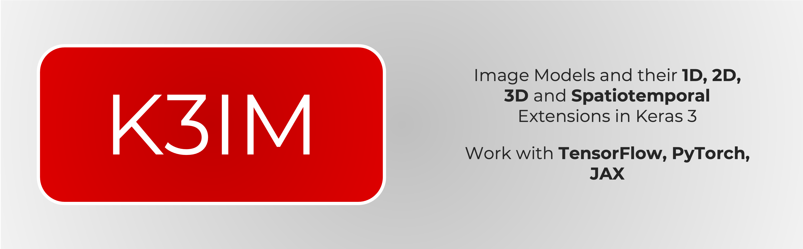

# \[beta\] K3IM: Keras 3 Image Models


## Installation

```shell
pip install k3im
```


## Usage

You can set up any backend using following commands:
```python
import os
os.environ['KERAS_BACKEND'] = 'jax' #or 'tensorflow' or 'torch' 
```

For usage, check out spin up notebooks.
<a target="_blank" href="https://colab.research.google.com/github/anas-rz/k3im">
  
</a>

### Compact Convolution Transformer :white_check_mark: 1D, :white_check_mark: Image/2D, :white_check_mark: 3D, :white_check_mark: space-time

CCT proposes compact transformers by using convolutions instead of patching and performing sequence pooling. This allows for CCT to have high accuracy and a low number of parameters.

1D
```python
from k3im.cct_1d import CCT_1DModel
model = CCT_1DModel(
    input_shape=(500, 1),
    num_heads=4,
    projection_dim=154,
    kernel_size=10,
    stride=15,
    padding=5,
    transformer_units=[154],
    stochastic_depth_rate=0.5,
    transformer_layers=1,
    num_classes=4,
    positional_emb=False,
)
```
2D
```python
from k3im.cct import CCT

model = CCT(
    input_shape=input_shape,
    num_heads=8,
    projection_dim=32,
    kernel_size=3,
    stride=3,
    padding=2,
    transformer_units=[16, 32],
    stochastic_depth_rate=0.6,
    transformer_layers=2,
    num_classes=num_classes,
    positional_emb=False,
)
```
3D
```python
from k3im.cct_3d import CCT3DModel
model = CCT3DModel(input_shape=(28, 28, 28, 1),
    num_heads=4,
    projection_dim=64,
    kernel_size=4,
    stride=4,
    padding=2,
    transformer_units=[16, 64],
    stochastic_depth_rate=0.6,
    transformer_layers=2,
    num_classes=num_classes,
    positional_emb=False,)
```
### ConvMixer :white_check_mark: 1D, :white_check_mark: Image/2D, :white_check_mark: 3D, :white_check_mark: space-time

ConvMixer uses recipes from the recent isotrophic architectures like ViT, MLP-Mixer (Tolstikhin et al.), such as using the same depth and resolution across different layers in the network, residual connections, and so on.

```python
from k3im.convmixer_1d import ConvMixer1DModel
model = ConvMixer1DModel(seq_len=500,
    n_features=1,
    filters=128,
    depth=4,
    kernel_size=15,
    patch_size=4,
    num_classes=n_classes,)
```
2D
```python
from k3im.convmixer import ConvMixer # Check convmixer

model = ConvMixer(
    image_size=28, filters=64, depth=8, kernel_size=3, patch_size=2, num_classes=10, num_channels=1
)
```
3D
```python
from k3im.convmixer_3d import ConvMixer3DModel
model = ConvMixer3DModel(image_size=28,
    num_frames=28,
    filters=32,
    depth=2,
    kernel_size=4,
    kernel_depth=3,
    patch_size=3,
    patch_depth=3,
    num_classes=10,
    num_channels=1)
```

### External Attention Network :white_check_mark: 1D, :white_check_mark: Image/2D, :white_check_mark: 3D, :white_check_mark: space-time

Based on two external, small, learnable, and shared memories, which can be implemented easily by simply using two cascaded linear layers and two normalization layers. It conveniently replaces self-attention as used in existing architectures. External attention has linear complexity, as it only implicitly considers the correlations between all samples.

```python
from k3im.eanet_1d import EANet1DModel
model = EANet1DModel(
    seq_len=500,
    patch_size=20,
    num_classes=n_classes,
    dim=96,
    depth=3,
    heads=32,
    mlp_dim=64,
    dim_coefficient=2,
    attention_dropout=0.0,
    channels=1,
)
```
2D
```python
from k3im.eanet import EANet
model = EANet(
    input_shape=input_shape,
    patch_size=7,
    embedding_dim=64,
    num_transformer_blocks=2,
    mlp_dim=32,
    num_heads=16,
    dim_coefficient=2,
    attention_dropout=0.5,
    projection_dropout=0.5,
    num_classes=10,
)
```
3D
```python
from k3im.eanet3d import EANet3DModel
model = EANet3DModel(
    image_size=28,
    image_patch_size=7,
    frames=28,
    frame_patch_size=7,
    num_classes=num_classes,
    dim=64,
    depth=2,
    heads=4,
    mlp_dim=32,
    channels=1,
    dim_coefficient=4,
    projection_dropout=0.0,
    attention_dropout=0,
)
```
### Fourier Net :white_check_mark: 1D, :white_check_mark: Image/2D, :white_check_mark: 3D, :white_check_mark: space-time

The FNet uses a similar block to the Transformer block. However, FNet replaces the self-attention layer in the Transformer block with a parameter-free 2D Fourier transformation layer:
One 1D Fourier Transform is applied along the patches.
One 1D Fourier Transform is applied along the channels.
### gMLP :white_check_mark: 1D, :white_check_mark: Image/2D, :white_check_mark: 3D, :white_check_mark: space-time

The gMLP is a MLP architecture that features a Spatial Gating Unit (SGU). The SGU enables cross-patch interactions across the spatial (channel) dimension, by:

1. Transforming the input spatially by applying linear projection across patches (along channels).

2. Applying element-wise multiplication of the input and its spatial transformation.

1D
```python
from k3im.gmlp_1d import gMLP1DModel
model = gMLP1DModel(seq_len=500, patch_size=20, num_classes=n_classes, dim=64, depth=4, channels=1, dropout_rate=0.0)
```
2D
```python
from k3im.gmlp import gMLPModel
model = gMLPModel(
    image_size=28,
    patch_size=7,
    embedding_dim=32,
    num_blocks=4,
    dropout_rate=0.5,
    num_classes=num_classes,
    positional_encoding=False,
    num_channels=1,
)
```
3D
```python
from k3im.gmlp_3d import gMLP3DModel
model = gMLP3DModel(
    image_size=28,
    image_patch_size=7,
    frames=28,
    frame_patch_size=7,
    num_classes=num_classes,
    dim=32,
    depth=4,
    hidden_units=32,
    dropout_rate=0.4,
    channels=1,
)
```

### MLP Mixer :white_check_mark: 1D, :white_check_mark: Image/2D, :white_check_mark: 3D, :white_check_mark: space-time

MLP-Mixer is an architecture based exclusively on multi-layer perceptrons (MLPs), that contains two types of MLP layers: 
One applied independently to image patches, which mixes the per-location features.
The other applied across patches (along channels), which mixes spatial information.
This is similar to a depthwise separable convolution based model such as the Xception model, but with two chained dense transforms, no max pooling, and layer normalization instead of batch normalization.

```python
from k3im.mlp_mixer_1d import Mixer1DModel
model = Mixer1DModel(seq_len=500, patch_size=20, num_classes=n_classes, dim=64, depth=4, channels=1, dropout_rate=0.0)
```
2D
```python
from k3im.mlp_mixer import MixerModel
model = MixerModel(
    image_size=28,
    patch_size=7,
    embedding_dim=32,
    num_blocks=4,
    dropout_rate=0.5,
    num_classes=num_classes,
    positional_encoding=True,
    num_channels=1,
)

```
3D
```python
from k3im.mlp_mixer_3d import MLPMixer3DModel

model = MLPMixer3DModel(
    image_size=28,
    image_patch_size=7,
    frames=28,
    frame_patch_size=7,
    num_classes=num_classes,
    dim=32,
    depth=4,
    hidden_units=32,
    dropout_rate=0.4,
    channels=1,
)
```
### Simple Vision Transformer :white_check_mark: 1D, :white_check_mark: Image/2D, :white_check_mark: 3D

```python
from k3im.simple_vit_1d import SimpleViT1DModel
model = SimpleViT1DModel(seq_len=500,
    patch_size=20,
    num_classes=n_classes,
    dim=32,
    depth=3,
    heads=8,
    mlp_dim=64,
    channels=1,
    dim_head=64)
```
3D

```python
from k3im.simple_vit_3d import SimpleViT3DModel

model = SimpleViT3DModel(
    image_size=28,
    image_patch_size=7,
    frames=28,
    frame_patch_size=7,
    num_classes=num_classes,
    dim=32,
    depth=2,
    heads=4,
    mlp_dim=32,
    channels=1,
    dim_head=64,
)
```
### Simple Vision Transformer with FFT  :white_check_mark: Image/2D
2D
```python
from k3im.simple_vit_with_fft import SimpleViTFFT
model = SimpleViTFFT(image_size=28, patch_size=7, freq_patch_size=7, num_classes=num_classes, dim=32, depth=2, 
                     heads=8, mlp_dim=64, channels=1, 
                     dim_head = 16)
```
### Simple Vision Transformer with Register Tokens :white_check_mark: Image/2D

Image/2D
```python
from k3im.simple_vit_with_register_tokens import SimpleViT_RT
model = SimpleViT_RT(image_size=28,
    patch_size=7,
    num_classes=num_classes,
    dim=32,
    depth=2,
    heads=4,
    mlp_dim=64,
    num_register_tokens=4,
    channels=1,
    dim_head=64,)
```
### Swin Transformer :white_check_mark: Image/2D

Swin Transformer is a hierarchical Transformer whose representations are computed with shifted windows. The shifted window scheme brings greater efficiency by limiting self-attention computation to non-overlapping local windows while also allowing for cross-window connections. 
```python
from k3im.swint import SwinTModel
model = SwinTModel(
    img_size=28,
    patch_size=7,
    embed_dim=32,
    num_heads=4,
    window_size=4,
    num_mlp=4,
    qkv_bias=True,
    dropout_rate=0.2,
    shift_size=2,
    num_classes=num_classes,
    in_channels=1,
)

```
### Vision Transformer :white_check_mark: 1D, :white_check_mark: Image/2D, :white_check_mark: 3D, :white_check_mark: space-time
```python
from k3im.vit_1d import ViT1DModel
model = ViT1DModel(seq_len=500,
    patch_size=20,
    num_classes=n_classes,
    dim=32,
    depth=3,
    heads=8,
    mlp_dim=64,
    channels=1,
    dim_head=64)
```

### Focal Modulation Network :white_check_mark: Image/2D
