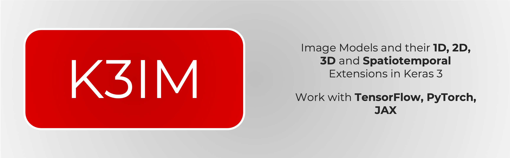

# K3IM: Keras 3 Image Models



**K3IM** empowers you with a rich collection of modern vision and classification models tailored for **1D data** (time series, signals, audio), **2D images**, **3D volumetric scans**, and **spatiotemporal video data**.

Built natively on **Keras 3**, all models effortlessly run across **TensorFlow**, **PyTorch**, or **JAX** without changing a single line of model code.

---

## Key Features

- **Multi-Backend Support**: Seamlessly switch between JAX, PyTorch, and TensorFlow backends.
- **Comprehensive Dimensionality Coverage**:
  - **1D Models**: Transformers, Mixers, and MLPs tailored for sequences and sensor signals.
  - **2D Image Models**: ViT, CaiT, CCT, Swin, ConvMixer, gMLP, FocalNet, MLP-Mixer, TokenLearner, and more.
  - **3D & Video Models**: 3D Vision Transformers, ConvMixer 3D, and space-time factorized architectures (ViViT, Video-Mixer, Video-EANet).
- **Lightweight & Modular**: High performance implementations with clean, readable code and minimal dependencies.

---

## Installation

```bash
pip install k3im
```

Or install in editable mode for development:

```bash
git clone https://github.com/anas-rz/k3im.git
cd k3im
pip install -e ".[dev]"
```

---

## Quickstart

### Choose Your Preferred Backend

Set the `KERAS_BACKEND` environment variable before importing Keras or K3IM:

```python
import os

# Choose one: "jax", "torch", or "tensorflow"
os.environ["KERAS_BACKEND"] = "jax"
```

### 1D Sequence Classification Example

```python
import keras
from k3im.simple_vit_1d import SimpleViT1DModel

model = SimpleViT1DModel(
    seq_len=500,
    patch_size=20,
    num_classes=10,
    dim=64,
    depth=4,
    heads=4,
    mlp_dim=128,
    channels=1,
)

model.compile(
    optimizer="adam",
    loss=keras.losses.SparseCategoricalCrossentropy(from_logits=True),
    metrics=["accuracy"],
)
```

### 2D Image Classification Example

```python
from k3im.vit import ViT

model = ViT(
    image_size=(224, 224),
    patch_size=(16, 16),
    num_classes=1000,
    dim=512,
    depth=6,
    heads=8,
    mlp_dim=1024,
    channels=3,
)
```

### 3D / Video Classification Example

```python
from k3im.vivit import ViViT

model = ViViT(
    image_size=64,
    image_patch_size=16,
    frames=16,
    frame_patch_size=2,
    num_classes=10,
    dim=128,
    spatial_depth=4,
    temporal_depth=4,
    heads=4,
    mlp_dim=256,
    channels=3,
)
```

---

## Navigation

- [1D Models](1d_models.md): Architectures specialized for 1D signals and time-series.
- [2D Models](2d_models.md): Full suite of 2D Vision Transformers, MLPs, and hybrid models.
- [3D Models](3d_models.md): Volumetric 3D architectures.
- [Space-Time Models](space_time_models.md): Factorized space-time models for video.
- [Layers & Blocks](layers.md): Reusable attention blocks, tokenizers, and custom layers.
